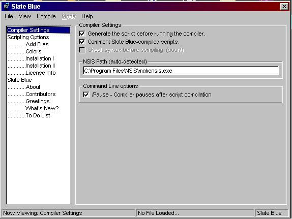



## A gui for the Nullsoft Install System \(NSIS\)

### Description

this is a gui for the command line based nullsoft install system
 
### More Info
 

             |
---                |---
**Submitted On**   |2001-08-13 11:57:08
**By**             |[Daniel Green](https://github.com/Planet-Source-Code/PSCIndex/blob/master/ByAuthor/daniel-green.md)
**Level**          |Advanced
**User Rating**    |4.8 (38 globes from 8 users)
**Compatibility**  |VB 6\.0
**Category**       |[Miscellaneous](https://github.com/Planet-Source-Code/PSCIndex/blob/master/ByCategory/miscellaneous__1-1.md)
**World**          |[Visual Basic](https://github.com/Planet-Source-Code/PSCIndex/blob/master/ByWorld/visual-basic.md)
**Archive File**   |[A gui for 245798132001\.zip](https://github.com/Planet-Source-Code/daniel-green-a-gui-for-the-nullsoft-install-system-nsis__1-26151/archive/master.zip)

